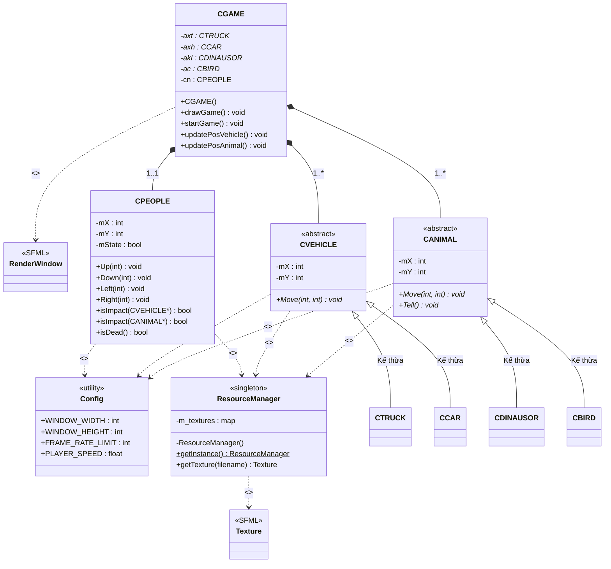

```mermaid
classDiagram
    %% ==========================================
    %% TẦNG 1: THƯ VIỆN NGOÀI & HỆ THỐNG
    %% ==========================================
    class RenderWindow {
        <<SFML>>
    }
    class Texture {
        <<SFML>>
    }

    class Config {
        <<utility>>
        +WINDOW_WIDTH : int
        +WINDOW_HEIGHT : int
        +FRAME_RATE_LIMIT : int
        +PLAYER_SPEED : float
    }
    
    class ResourceManager {
        <<singleton>>
        -m_textures : map
        -ResourceManager()
        +getInstance() ResourceManager$
        +getTexture(filename) Texture
    }

    %% ==========================================
    %% TẦNG 2: THỰC THỂ TRONG GAME
    %% ==========================================
    class CPEOPLE {
        -mX : int
        -mY : int
        -mState : bool
        +Up(int) void
        +Down(int) void
        +Left(int) void
        +Right(int) void
        +isImpact(CVEHICLE*) bool
        +isImpact(CANIMAL*) bool
        +isDead() bool
    }

    class CVEHICLE {
        <<abstract>>
        -mX : int
        -mY : int
        +Move(int, int)* void
    }

    class CTRUCK
    class CCAR

    class CANIMAL {
        <<abstract>>
        -mX : int
        -mY : int
        +Move(int, int)* void
        +Tell()* void
    }

    class CDINAUSOR
    class CBIRD

    %% ==========================================
    %% TẦNG 3: BỘ NÃO ĐIỀU KHIỂN
    %% ==========================================
    class CGAME {
        -axt : CTRUCK*
        -axh : CCAR*
        -akl : CDINAUSOR*
        -ac : CBIRD*
        -cn : CPEOPLE
        +CGAME()
        +drawGame() void
        +startGame() void
        +updatePosVehicle() void
        +updatePosAnimal() void
    }

    %% ==========================================
    %% CÁC MỐI QUAN HỆ (RELATIONSHIPS)
    %% ==========================================

    %% 1. Quan hệ Kế thừa (Inheritance): Mũi tên nét liền, đầu tam giác rỗng
    CVEHICLE <|-- CTRUCK : Kế thừa
    CVEHICLE <|-- CCAR : Kế thừa
    CANIMAL <|-- CDINAUSOR : Kế thừa
    CANIMAL <|-- CBIRD : Kế thừa

    %% 2. Quan hệ Bao gộp (Composition): Mũi tên nét liền, chuôi hình thoi đặc
    CGAME *-- CPEOPLE : 1..1 
    CGAME *-- CVEHICLE : 1..* 
    CGAME *-- CANIMAL : 1..*

    %% 3. Quan hệ Phụ thuộc (Dependency): Mũi tên nét đứt, đầu nhọn hở
    %% Hệ thống phụ thuộc SFML
    ResourceManager ..> Texture : <<use>>
    CGAME ..> RenderWindow : <<use>>
    
    %% Thực thể gọi file Config để lấy hằng số
    CPEOPLE ..> Config : <<use>>
    CVEHICLE ..> Config : <<use>>
    CANIMAL ..> Config : <<use>>
    
    %% Thực thể gọi ResourceManager để lấy hình ảnh
    CPEOPLE ..> ResourceManager : <<use>>
    CVEHICLE ..> ResourceManager : <<use>>
    CANIMAL ..> ResourceManager : <<use>>
```
