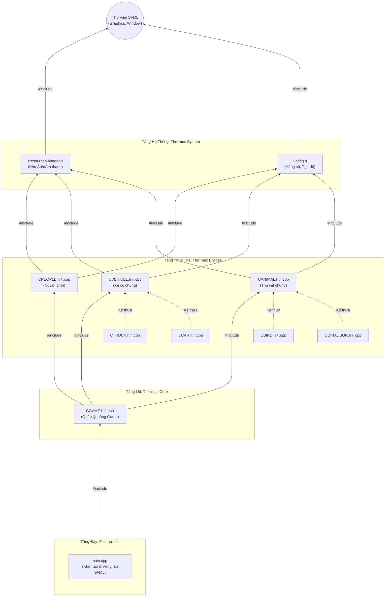

```mermaid
%%{init: {"flowchart": {"nodeSpacing": 100, "rankSpacing": 130}}}%%
graph BT
    %% --- TẦNG 1: Vòng lặp chính ---
    subgraph L1 [Tầng Đáy: File thực thi]
        Main["main.cpp <br> (Khởi tạo & Vòng lặp SFML)"]
    end

    %% --- TẦNG 2: Bộ não trò chơi ---
    subgraph L2 [Tầng Lõi: Thư mục Core]
        Game["CGAME.h / .cpp <br> (Quản lý luồng Game)"]
    end

    %% --- TẦNG 3: Các đối tượng trong game ---
    subgraph L3 [Tầng Thực Thể: Thư mục Entities]
        People["CPEOPLE.h / .cpp <br> (Người chơi)"]
        
        Vehicle["CVEHICLE.h / .cpp <br> (Xe cộ chung)"]
        Truck["CTRUCK.h / .cpp"]
        Car["CCAR.h / .cpp"]
        
        Animal["CANIMAL.h / .cpp <br> (Thú vật chung)"]
        Bird["CBIRD.h / .cpp"]
        Dino["CDINAUSOR.h / .cpp"]
    end

    %% --- TẦNG 4: Quản lý tài nguyên & Hằng số ---
    subgraph L4 [Tầng Hệ Thống: Thư mục System]
        Config["Config.h <br> (Hằng số, Tọa độ)"]
        RM["ResourceManager.h <br> (Kho Ảnh/Âm thanh)"]
    end

    %% --- TẦNG 5: Thư viện ngoài ---
    SFML(("Thư viện SFML <br> (Graphics, Window)"))

    %% ==========================================
    %% CÁC ĐƯỜNG LIÊN KẾT (Include & Kế thừa)
    %% ==========================================

    %% 1. Luồng Include từ dưới lên (Dùng 4 gạch để kéo dài khoảng cách)
    Main ---->|"#include"| Game
    
    %% Tầng Core gọi Thực thể (Dùng 3 gạch)
    Game --->|"#include"| People
    Game --->|"#include"| Vehicle
    Game --->|"#include"| Animal
    
    %% 2. Luồng Kế thừa (Nét đứt)
    Truck -. "Kế thừa" .-> Vehicle
    Car -. "Kế thừa" .-> Vehicle
    Bird -. "Kế thừa" .-> Animal
    Dino -. "Kế thừa" .-> Animal
    
    %% 3. Gọi các file Hệ thống dùng chung
    People --->|"#include"| Config
    People --->|"#include"| RM
    
    Vehicle --->|"#include"| Config
    Vehicle --->|"#include"| RM
    
    Animal --->|"#include"| Config
    Animal --->|"#include"| RM
    
    %% 4. Tầng hệ thống gọi thư viện SFML
    RM ---->|"#include"| SFML
    Config ---->|"#include"| SFML
```
